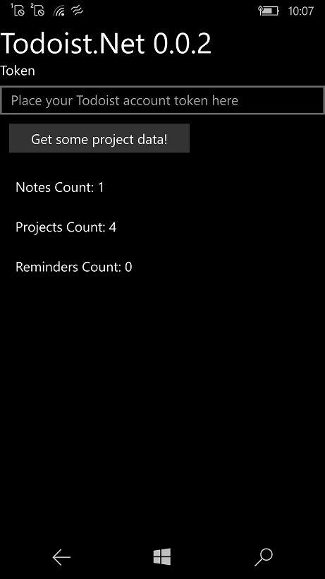

# TodoistX

"TodoistX" is planned as lite version of Todoist app for Windows 10 Mobile Lumia fans. =)

## Screenshots



## Tech details

- Platform: UWP (I have plans to "jump" into/onto XF)
- Targets: ARM, x64
- OS: Windows 10/11, Windows 10 Mobile (os build: 15063 or above)
- Status: Prototype / Alpha version


## Get started

### About dev/test credentials

Register your dev account here https://developer.todoist.com/ and get test token? etc.

Find SettingsProvider.cs and paste the test token here:
```csharp
 public static string GetToken()
 {
   return "xxxxxxx";// paste here your todoist test token
 } 
```

### About Todoist.net Library
- Use the modern Todoist.Net library to extend functionality of my proto.
- The library is available as a [Nuget package](https://www.nuget.org/packages/Todoist.Net/).

### Creating Todoist client

With token (preferred way).
```csharp
ITodoistClient client = new TodoistClient("API token");
```

With email and password.
```csharp
ITodoistTokenlessClient tokenlessClient = new TodoistTokenlessClient();
ITodoistClient client = await tokenlessClient.LoginAsync("email", "password");
```

### Quick add

Implementation of the Quick Add Task available in the official clients.
```csharp
var quickAddItem = new QuickAddItem("Task title @Label1 #Project1 +ExampleUser");
var task = await client.Items.QuickAddAsync(quickAddItem);
```

### Simple API calls
```csharp
// Get all resources (labels, projects, tasks, notes etc.).
var resources = await client.GetResourcesAsync();

// Get only projects and labels.
var projectsAndLabels = await client.GetResourcesAsync(ResourceType.Projects, ResourceType.Labels);

// Get only projects.
var projectsOnly = await client.GetResourcesAsync(ResourceType.Projects);

// Alternatively you can use this API to get projects.
var projects = await client.Projects.GetAsync();

// Add a task with a note.
var taskId = await client.Items.AddAsync(new Item("New task"));
await client.Notes.AddToItemAsync(new Note("Task description"), taskId);
```

### Transactions (Batching)
Batching: reading and writing of multiple resources can be done in a single HTTP request.

Add a new project, task and note in one request.
```csharp
// Create a new transaction.
var transaction = client.CreateTransaction();

// These requests are queued and will be executed later.
var projectId = await transaction.Project.AddAsync(new Project("New project"));
var taskId = await transaction.Items.AddAsync(new Item("New task", projectId));
await transaction.Notes.AddToItemAsync(new Note("Task description"), taskId);

// Execute all the requests in the transaction in a single HTTP request.
await transaction.CommitAsync();

```

## Referencies
- A [Todoist.Net](https://github.com/olsh/todoist-net) library for .NET
- A [Todoist Sync API](https://developer.todoist.com/sync/v8/).


## ..
AS IS. No support. RnD only.


-- [m][e] 2022